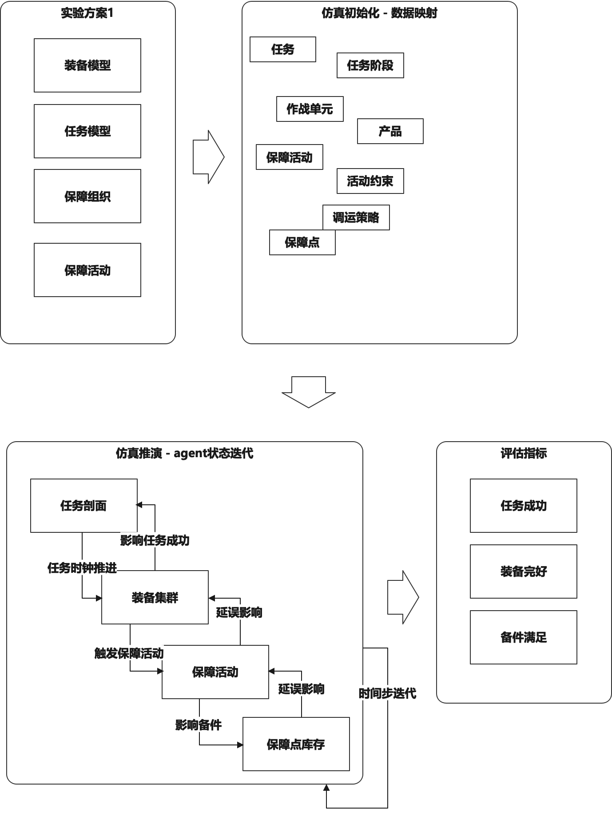
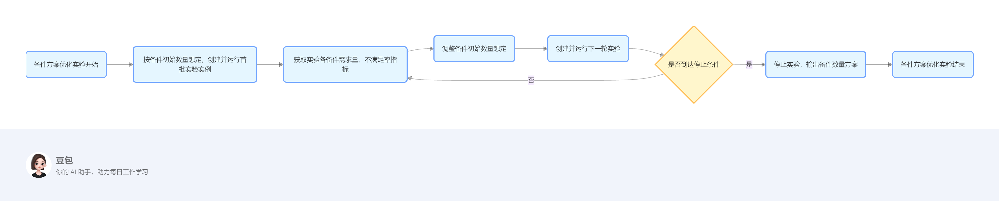
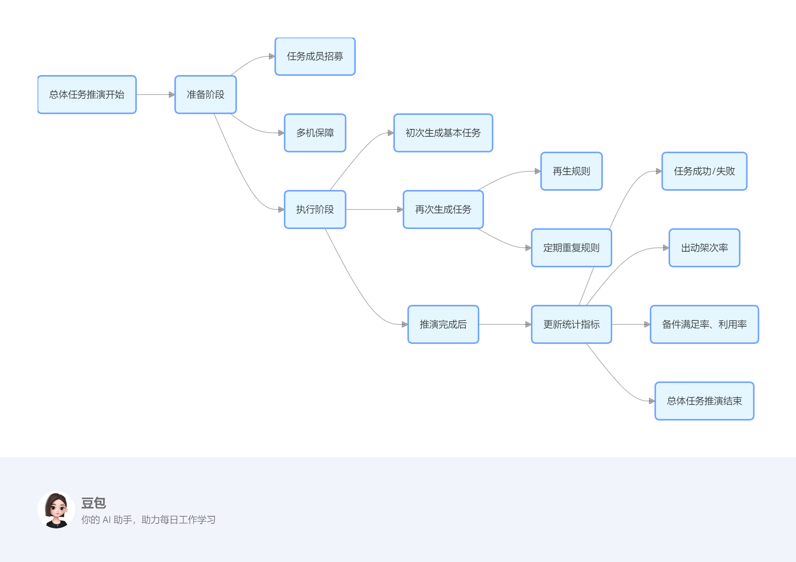
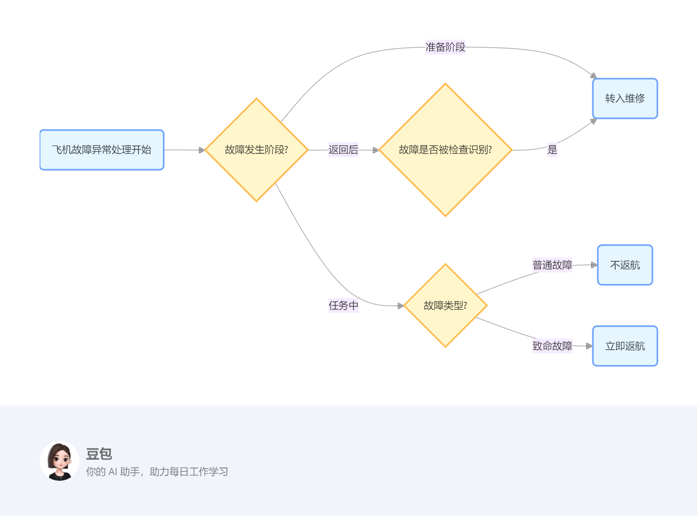
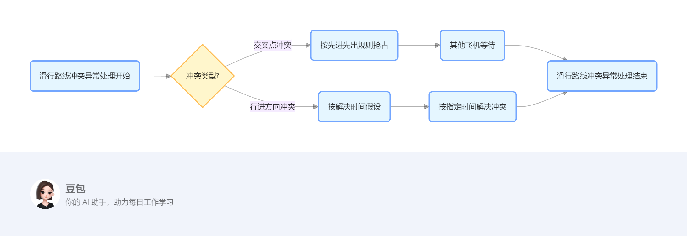
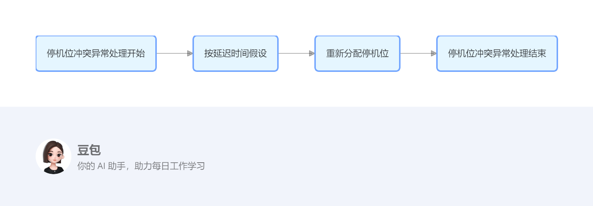
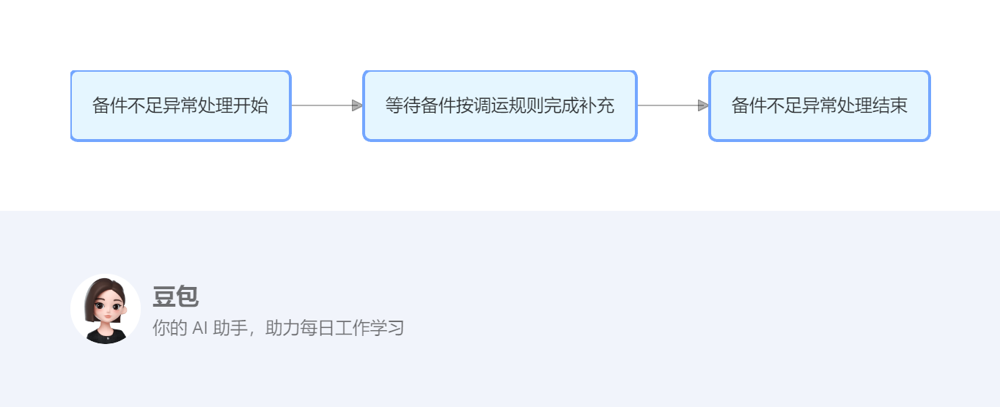
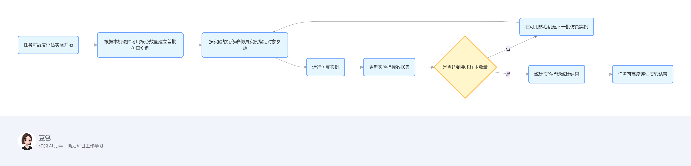
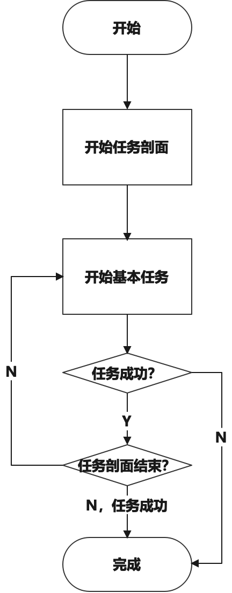
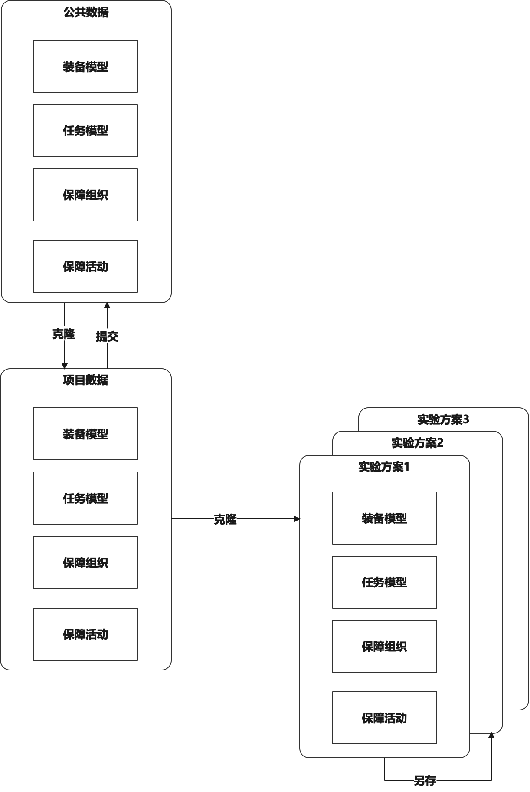

# 备件规划及任务可靠度验证评估平台概要设计方案

> 来源：`docs/3概要设计方案.docx`。本 Markdown 由 docx 结构化转换生成，保留标题、正文、表格和图片引用；公式和部分 WMF 图形可能需要后续人工校核。

|  | 签名 |
| --- | --- |
| 编写 |  |
| 校对 |  |
| 审核 |  |
| 批准 |  |

陕西可维卓立科技有限公司

## 范围

### 标识

本文档的标识号：GYSJ-BJGHJRWLKDYZPGPT

本文档的全称：备件规划及任务可靠度验证评估平台需求规格说明

本文档适用的产品见表 1。

*表 1本文档适用的产品*

| 类别 | 名称 | 标识号 | 缩略名 | 版本号 | 发布号 |
| --- | --- | --- | --- | --- | --- |
| 软件 | 备件规划及任务可靠度验证评估平台 | BJGHJRWKKDPGPT | BJGH | 0.0.0.1 |  |

### 系统概述

备件规划及任务可靠度验证评估平台应具备备件规划和任务可靠度评估功能。

（1）备件规划评估模块：包括飞机寿命前置功能、单次仿真、数据提取、备件清单优化等功能。

（2）任务可靠度评估模块：包括飞机可靠性框图设置、停机因素分析、任务可靠性评估、指标分配方案管理等功能。

（3）系统运行支持模块：主要针对长周期⼤样本蒙特卡洛实验的软件使用场景，对软件运行效率进行优化设计。

*图 1 系统概况*

## CSCI体系结构设计

### CSCI部件

#### 部件组成

备件规划及任务可靠度验证评估平台包括备件规划评估模块和任务可靠度评估模块两个核心功能模块，以及系统运行支持模块。

采用《需求规格说明书》的3.2、3.3节功能需求，共2个一级功能、6个二级功能、16个三级功能、47个四级功能。

*表 2平台部件组成*

| 部件名称 | 二级功能 | 三级功能 | 四级功能 |
| --- | --- | --- | --- |
| 备件规划评估模块 | 仿真建模 | 任务建模 | 内置场景 |
| 备件规划评估模块 | 仿真建模 | 任务建模 | 基本作战单元建模 |
| 备件规划评估模块 | 仿真建模 | 任务建模 | 基本任务建模 |
| 备件规划评估模块 | 仿真建模 | 任务建模 | 任务剖面建模 |
| 备件规划评估模块 | 仿真建模 | 装备建模 | 装备组成建模 |
| 备件规划评估模块 | 仿真建模 | 装备建模 | 装备故障建模 |
| 备件规划评估模块 | 仿真建模 | 保障组织建模 | 保障组织结构建模 |
| 备件规划评估模块 | 仿真建模 | 保障组织建模 | 备件建模 |
| 备件规划评估模块 | 仿真建模 | 保障组织建模 | 保障人员建模 |
| 备件规划评估模块 | 仿真建模 | 保障组织建模 | 保障设备建模 |
| 备件规划评估模块 | 仿真建模 | 保障活动建模 | 保障资源需求组 |
| 备件规划评估模块 | 仿真建模 | 保障活动建模 | 装备修复性维修方案 |
| 备件规划评估模块 | 仿真建模 | 保障活动建模 | 装备预防性维修方案 |
| 备件规划评估模块 | 仿真建模 | 保障活动建模 | 装备使用保障方案 |
| 备件规划评估模块 | 仿真建模 | 指标分配方案管理 | 结果导入 |
| 备件规划评估模块 | 仿真实验 | 仿真实验方案管理 | 仿真实验方案创建 |
| 备件规划评估模块 | 仿真实验 | 仿真实验方案管理 | 仿真实验方案编辑 |
| 备件规划评估模块 | 仿真实验 | 可视化推演 | 可视化实验启动与停止 |
| 备件规划评估模块 | 仿真实验 | 可视化推演 | 场景切换 |
| 备件规划评估模块 | 仿真实验 | 可视化推演 | 可视化结果展示 |
| 备件规划评估模块 | 仿真实验 | 蒙特卡洛实验 | 蒙特卡洛实验配置 |
| 备件规划评估模块 | 结果分析 | 结果分析 | 蒙特卡洛实验结果展示 |
| 备件规划评估模块 | 结果分析 | 结果分析 | 备件短板分析 |
| 备件规划评估模块 | 结果分析 | 结果分析 | 飞机转场携行清单分析 |
| 任务可靠度评估模块 | 仿真建模 | 任务建模 | 内置场景 |
| 任务可靠度评估模块 | 仿真建模 | 任务建模 | 基本作战单元建模 |
| 任务可靠度评估模块 | 仿真建模 | 任务建模 | 基本任务建模 |
| 任务可靠度评估模块 | 仿真建模 | 任务建模 | 任务剖面建模 |
| 任务可靠度评估模块 | 仿真建模 | 装备建模 | 装备组成建模 |
| 任务可靠度评估模块 | 仿真建模 | 装备建模 | 装备故障建模 |
| 任务可靠度评估模块 | 仿真建模 | 装备建模 | 装备可靠性框图建模 |
| 任务可靠度评估模块 | 仿真建模 | 保障组织建模 | 保障组织结构建模 |
| 任务可靠度评估模块 | 仿真建模 | 保障组织建模 | 备件建模 |
| 任务可靠度评估模块 | 仿真建模 | 保障组织建模 | 保障人员建模 |
| 任务可靠度评估模块 | 仿真建模 | 保障组织建模 | 保障设备建模 |
| 任务可靠度评估模块 | 仿真建模 | 保障活动建模 | 保障资源需求组 |
| 任务可靠度评估模块 | 仿真建模 | 保障活动建模 | 装备修复性维修方案 |
| 任务可靠度评估模块 | 仿真建模 | 保障活动建模 | 装备预防性维修方案 |
| 任务可靠度评估模块 | 仿真建模 | 保障活动建模 | 装备使用保障方案 |
| 任务可靠度评估模块 | 仿真实验 | 仿真实验方案管理 | 仿真实验方案创建 |
| 任务可靠度评估模块 | 仿真实验 | 仿真实验方案管理 | 仿真实验方案编辑 |
| 任务可靠度评估模块 | 仿真实验 | 可视化推演 | 可视化实验启动与停止 |
| 任务可靠度评估模块 | 仿真实验 | 可视化推演 | 场景切换 |
| 任务可靠度评估模块 | 仿真实验 | 可视化推演 | 可视化结果展示 |
| 任务可靠度评估模块 | 仿真实验 | 蒙特卡洛实验 | 蒙特卡洛实验配置 |
| 任务可靠度评估模块 | 结果分析 | 结果分析 | 蒙特卡洛实验结果展示 |
| 任务可靠度评估模块 | 结果分析 | 结果分析 | 飞机任务可靠性分析 |
| 任务可靠度评估模块 | 结果分析 | 结果分析 | 任务可靠度评估 |
| 任务可靠度评估模块 | 结果分析 | 结果分析 | 停机因素分析 |

### 执行方案

#### 仿真数据流总体设计

从数据流的角度，仿真推演过程是对建模数据进行的转换计算。这种计算包含数据映射与仿真模型实例化、仿真推演、指标输出三个主要环节。

*图 2 仿真数据流总体设计*

从不同的功能目标出发，可以该流程为基础框架，进行各模块交互关系的细化设计。

##### 数据映射与仿真模型实例化

使用 RESTful API 作为接口风格，用户启动仿真实验后，仿真后台发送 HTTP 请求到仿真建模模块，仿真建模模块接收到请求后，发送 JSON 数据。

仿真后台得到JSON数据后，将 JSON 数据转换为 agent 类和实例，可以实现数据模型在接口和仿真模型之间的传输和实例化。

##### 基于ABM的仿真推演技术

首先，以典型任务剖面为切入点，按照任务类、系统类、保障类和环境类梳理各要素的正常功能行为，异常状态和防控相关行为。针对任务类，主要关注任务的分配和调整；针对系统类和保障类，重点关注要素的空闲状态、工作状态1 到n、健康退化状态、故障状态、测试状态、维修状态，以及各状态转换的相关行为。针对环境类，重点关注时空间环境约束及其影响。

然后，将相关实体要素和任务逻辑封装为相应的智能体类，分析其交互机制，兼顾数据驱动的需求，设计仿真的整体架构。

最后，确定每类智能体的生命状态图，并重点考虑环境感知及消息模块、行为规划模型、动作执行模块，以及内部状态库等部件，构建各智能体的交互关系。

#### 备件规划评估模块

##### 整体流程

备件规划评估的执行流程是围绕任务需求产生装备使用要求，在装备使用过程中产生故障，最终形成备件需求。

##### 数据映射与实例化

仿真实例化时，首先将JSON数据映射为任务、装备、产品、保障活动、保障资源等各java类的实例。

然后，按智能体仿真算法框架，生成机场、飞机、保障人员、保障设备等智能体实例。

##### 仿真推演

###### 仿真初始化

仿真初始化是整个仿真推演流程的起始阶段，其主要目的是为后续的仿真运行准备必要的资源和环境，并将相关配置参数准确映射到实验对象上进行实例化。该阶段包含系统资源加载和配置参数映射与实验对象实例化两个关键部分。

###### 仿真推演过程

###### 备件方案优化实验

备件方案优化实验是仿真推演过程中的关键环节，其核心目标是通过多次实验迭代，找到最优的备件数量方案，以在满足任务需求的前提下，尽可能降低备件成本和资源浪费。实验基于备件初始数量想定，通过不断调整该想定并运行实验，根据实验结果中的备件需求量和不满足率指标来逐步优化备件方案，直至达到停止条件。

*图 3 备件方案优化实验*

###### 总体任务推演

总体任务推演过程是仿真推演中的重要环节，它模拟了一个完整的任务从准备到执行，再到结束后的指标统计的全过程。通过该推演过程，可以评估任务的可行性、成员和资源的利用效率等，为实际任务的规划和决策提供有力依据。

*图 4 总体任务推演过程*

（1）基本任务

基本任务过程是仿真推演中一个重要的组成部分，它模拟了一个基本任务从成员管理、任务执行到最终结果判定的完整流程。通过对这一过程的详细模拟，可以准确评估任务执行过程中的各种情况，为整体的仿真推演提供可靠的数据和决策依据。

（1）任务成员管理

（2）任务执行

（3）任务成败结果生成

###### 飞机流程

飞机流程是仿真推演中模拟飞机在一次或多次任务中的状态转换和相关操作过程。该流程从飞机的仿真实例化开始，经历待命、准备、出动、任务执行、回收、飞行后检查等多个状态，根据不同的条件和事件进行状态转换，若未被解除任务则会再次进入准备状态，继续参与后续任务。

###### 机场流程

（1）任务成员分配流程

（2）使用保障流程

多机出动流程

单机保障流程

（3）出动回收状态切换

（4）出动回收流程

（5）维修流程

（6）预防性维修流程

（7）备件调运流程

###### 异常处理流程

###### 飞机故障

飞机故障异常处理流程主要针对飞机在不同阶段（准备阶段、任务中、返回后）出现故障的情况制定相应的处理策略，以保障飞机和任务的安全与顺利进行。根据故障发生的阶段和类型，采取不同的处理措施，确保飞机故障能得到及时、合理的解决。

*图 5 飞机故障处理流程*

（1）准备阶段出现故障

（2）任务中出现故障

（3）返回后出现故障

###### 滑行路线冲突

滑行路线冲突异常处理流程主要针对飞机在滑行过程中出现的交叉点冲突和行进方向冲突两种情况，分别制定了相应的解决策略，以确保机场滑行道的安全和高效运行，避免飞机之间发生碰撞等危险情况。

*图 6滑行路线冲突*

###### 停机位冲突

停机位冲突异常处理流程主要聚焦于解决飞机在分配停机位时出现冲突的情况。当多架飞机同时需要使用同一个停机位或者多个停机位分配出现矛盾时，通过按延迟时间假设的方式来重新分配停机位，以确保机场停机位资源的合理利用和飞机的有序停放。

*图 7停机位冲突*

###### 备件不足

备件不足异常处理流程主要针对在仿真推演过程中出现备件数量无法满足需求的情况。该流程核心在于按照既定的调运规则等待备件完成补充，以保障相关作业（如飞机维修、设备维护等）能够继续进行，维持系统的正常运行。

*图 8 备件不足*

###### 装备任务与保障仿真模型

在多智能体模型基础上，设计装备、任务、保障各类智能体类，利用任务牵引、保障支撑交互模式，推进装备任务时钟、并触发故障事件。

###### 基于仿真的备件需求仿真

在装备任务与保障仿真模型基础上，运行大样本实验，可以采集每个仿真样本中的故障种类和次数，从而得到备件需求量预测数据集。

##### 指标输出

###### 备件利用率

备件利用率是消耗的备件数量与初始备件数量之间的比例，其通常用来衡量备件方案的经济效率。其表达式如下：

其中，为消耗的备件数量，为初始备件数量。

###### 备件满足率

备件满足率是在每次产生备件使用需求的时刻，备件能够满足需求的次数比例。其表达式如下：

其中s为第n种备件的满足率，s(n,t) = (t时刻第n种备件可使用量)/(t时刻第n种备件使用需求量)。

#### 任务可靠度评估模块

##### 整体流程

任务可靠度评估的执行流程是围绕任务需求产生装备使用要求，装备在使用过程中产生不可用状态，通过对任务周期中装备不可用状态对任务可靠度的累积影响，进行任务可靠度评估。

##### 数据映射与实例化

仿真实例化时，首先将JSON数据映射为任务、装备、产品、保障活动、保障资源等各实例。

然后，按智能体仿真算法框架，生成机场、飞机、保障人员、保障设备等智能体实例。

##### 仿真推演

###### 仿真初始化

同2.1.1.10.1章节。

###### 仿真推演过程

同2.1.1.10.2章节，新增任务可靠度评估实验过程。

###### 任务可靠度评估实验

任务可靠度评估实验是仿真推演过程中的重要环节，其目的是通过多次运行仿真实例，收集相关数据，以评估任务在不同条件下的可靠程度。该实验通过合理利用本机硬件资源，按照一定的流程逐步增加仿真实例的运行数量，直至达到要求的样本数量，从而获得较为准确的评估结果。

*图 9 任务可靠度评估实验流程*

（1）根据运行仿真的本机硬件可用核心数量，建立首批仿真实例

（2）按任务可靠度评估实验想定，修改仿真实例中的指定对象参数

（3）运行仿真实例，仿真实例运行结束后，更新实验指标数据集

（4）在可用核心创建下一批仿真实例并运行，直至达到要求样本数量

（5）统计实验指标统计结果

###### 异常处理流程

同2.1.1.10.3章节。

##### 指标输出

###### 战备完好率

战备完好率指飞机能随时执行作战任务的完好数与实有数的比值。在一次仿真过程中，按指定时间间隔对该指标进行采样，最后获得全部仿真周期的平均战备完好率。

其中 表示t时刻可用装备数量，表示t时刻全部装备数量。

基于多次实验结果，战备完好率的计算方法如下：

###### 任务可靠度

任务可靠度定义为如果某次任务中的飞机在出动集结及任务执行限定时间内，数量始终满足最低要求出动数量，则判定该次侦查任务成功，否则判定为该任务失败。

影响任务成功的因素有航母及舰船健康状态、出动前保障作业的及时性、数据链的连通性、作战过程中战损等。此外每类任务的最低要求出动数量也可能是不同的，所以的判定是在仿真过程中动态进行的。

*其中State(ZC)表示侦查任务状态，State(ZZ)表示作战任务状态，State(WB)表示维修保障任务状态*

在单次仿真中的任务成功率计算方法为：

其中N为全部出动波次数量。

基于多次实验结果，飞机任务成功率的计算方法如下：

###### 出动架次率

飞机的出动架次率为：

其中N为至少出动一次的飞机数量，为第i架飞机在仿真期间的总出动次数。

经过N次仿真，飞机的出动架次率为

（2.1）

###### 波次出动时间

一个任务波次的全部飞机从开始准备到完成出动所需的时间。

在第i次单次仿真过程中，波次出动时间为：

（2.2）

式中为第k次完成波次出动的时间

经过N次仿真，波次出动时间为各样本的平均值：

（2.3）

###### 波次回收时间

一个任务波次的全部飞机从第一架开始降落到最有一架完成回收工作的时间。

在第i次单次仿真过程中，波次回收时间为：

（2.4）

式中为第k次完成波次回收的时间

经过N次仿真，波次回收时间为各样本的平均值：

（2.5）

###### 再次出动准备时间

后续任务波次的全部飞机从第一架开始准备到最后一架完成起飞所需的时间。主要包括：飞行前检查、冲填加挂、起飞调运、弹射起飞等。

单次仿真过程中，再次出动时间为：

（2.6）

式中：—整建制单位第i次仿真第k次完成再次出动的时间，h。

进一步可知，经过N次仿真，批次出动时间为

（2.7）

### 接口设计

#### 内部接口设计

*表 3内部接口关系*

| 序号 | 模块 | 功能 | 接口内容 | 输入/输出 | 来源/去向 |
| --- | --- | --- | --- | --- | --- |
| 1 | 备件规划 | 仿真建模 | 传递实验想定数据 | 实验方案数据 | 仿真实验 |
| 1 | 备件规划 | 仿真实验 | 保存实验结果数据 | 实验想定数据、实验结果数据集 | 结果分析 |
| 2 | 任务可靠度评估 | 仿真建模 | 传递实验想定数据 | 实验方案数据 | 仿真实验 |
| 2 | 任务可靠度评估 | 仿真实验 | 保存实验结果数据 | 实验想定数据、实验结果数据集 | 结果分析 |

## 系统功能原理

### 备件规划评估模块

#### 仿真建模

##### 任务建模

###### 内置场景

对任务场景进行编辑，配置装备的出发机场和任务区。原型页面字段包括机场名称、位置、跑道类型、距任务区距离，以及任务区名称、类型、距出发机场距离、任务区半径、威胁等级等属性。

###### 基本作战单元建模

配置装备的类型、数量、部署位置。原型页面参考 `vendor/ship_front` 的基本使用单元建模形态，展示编队需求、成员飞机编号、剩余寿命和备用机清单。

###### 基本任务建模

原型页面参考 `vendor/ship_front` 的基本任务建模形态，按飞机类型组织基本任务结构树，并编辑基本任务名称、任务编号、任务区域、装备数量、使用保障活动、任务时长、准备时间和取消时间等属性。运行时仍保留成功点、出发时间、返回时间比、任务优先级、最小系统数量等仿真字段。

###### 任务剖面建模

包含长周期任务、多机集群任务,引用基本任务，对任务开始时点、结束条件、重复周期进行配置。原型页面参考 `vendor/ship_front` 的复合任务和周期性任务建模形态，维护复合任务列表、当前复合任务包含的基本任务、典型组合任务时序表，以及按星期分配复合任务的周期性任务建模表。对于集群任务模型，可使用活动图，在时间轴上明确规定各编队任务的启动触发条件和结束条件；对于编队任务模型，使用有限状态机配置任务各阶段的状态、属性和转移条件，还可以配置任务的自动再生；对于单机任务，用有限状态机，可描述装备在不同使用模式下的任务剖面各状态以及故障维修、预防性维修等不可用状态之间的转移关系。

##### 装备建模

###### 装备组成建模

装备组成是对装备内部各组成部分之间的逻辑关系和功能交互的抽象描述，包括以下内容：

组件清单：将装备按照功能划分为不同的模块，如控制系统、动力系统、通信系统等。

组件逻辑结构：组件上下级关系。

原型页面参考 `vendor/ship_front` 的装备树建模形态，按装备根节点组织组件树，并在组成属性中维护父节点、组件数量、连接类型和 n 中取 k 参数。

###### 装备故障建模

装备故障用于描述装备可能出现的故障类型、故障发生模型。

故障类型分类：对装备可能发生的故障进行分类，如随机发布、寿命类、退化类等。每种故障类型可能有不同的表现形式和影响程度。

故障发生模型：包括概率分布模型、退化模型、最大寿命等。

原型页面与装备组成树共用组件属性数据，并在故障属性中维护故障模型、失效率、MTBF、寿命限制和 n 中取 k 结构参数。装备故障建模页同时显示 RMS 指标，包括可靠度、维修度、保障性、平均修复时间、平均保障延迟和固有可用度，用于承接指标分配导入后的组件级 RMS 数据。

##### 保障组织建模

###### 保障组织结构建模

（1）定义与目的

保障组织结构建模用于规划和管理作战保障的组织架构。其目的是建立高效的保障组织体系，提高保障工作的效率和质量。

能够建立不同级别的保障组织策略，建立保障组织之间的运输策略，支持设置横向保障组织。

建立保障组织树状图，可在输入文件中配置不同保障组织的级别、保障组织之间的调运信息以及横向、纵向调运策略。

*图 12 保障组织树状图*

（2）关键要素

组织架构设计：根据作战任务和保障需求，设计合理的保障组织架构。包括指挥机构、保障部门、维修单位、供应单位等的设置和职责划分。

（3）作用与影响

合理的保障组织模型可以提高保障工作的效率和质量，增强保障组织的协同作战能力和应急响应能力。

###### 备件建模

（1）定义与目的

备件建模用于规划和管理作战所需的各种物资和装备的供应。其目标是确保物资和装备的及时供应，满足作战任务的需求。

（2）关键要素

需求预测：根据任务需求和历史数据，预测各种备件和装备的需求量。

供应计划制定：根据需求预测和库存情况，制定合理的供应计划。包括备件的采购、运输、储存和分配等。

供应链管理：优化备件的供应链，确保备件的及时供应和质量可靠。包括供应商管理、物流管理、库存管理等。

应急保障：制定应急保障方案，应对突发情况和紧急需求。

###### 保障人员建模

（1）定义与目的

保障人员建模用于规划和管理作战保障的人员配置。其目的是建立高效的保障组织体系，提高保障工作的效率和质量。

（2）关键要素

人员配置：根据组织架构和任务需求，合理配置保障人员。包括人员的数量、专业技能和岗位安排等。

###### 保障设备建模

（1）定义与目的

保障设备建模用于规划和管理作战保障所需的保障设备配置。其目的是优化保障设备配置，提高保障设备利用率，满足作战任务的需求。

（2）关键要素

保障设备需求分析：根据作战任务和保障需求，分析所需的各种资源的数量。

保障设备评估与调整：定期对保障设备的使用情况进行评估，根据评估结果进行资源调整和优化。

##### 保障活动建模

###### 保障资源需求组

保障资源需求组是为各个保障活动分配不同的保障资源需求组合。在建模时，根据不同的分析需求，可以将保障活动建为不同的颗粒度，如将飞行前保障作为一个单一活动，或飞行前准备的加油、挂弹等作业作为保障活动。同理，也可建立不同颗粒度的维修保障活动。每个保障资源需求组里配置不同种类的保障设备和不同岗位的保障人员。

###### 装备修复性维修方案

装备修复性维修方案是针对装备发生故障后进行的维修活动所制定的计划。它包括以下方面：

故障诊断：当装备发生故障时，迅速进行故障诊断，确定故障的类型、位置和原因。故障诊断可以采用经验判断、仪器检测、数据分析等方法。

维修策略选择：根据故障的严重程度和影响范围，选择合适的维修策略。常见的维修策略包括更换故障部件、修复故障部件、调整设备参数等。

维修资源准备：确定维修所需的人员、工具、设备和备件等资源，并确保这些资源能够及时到位。维修资源准备可以包括维修人员的调配、工具设备的准备和备件的采购等。

###### 装备预防性维修方案

装备预防性维修方案是为了防止装备发生故障而进行的定期维护和检查活动所制定的计划。它包括以下方面：

维护周期：根据装备的使用情况、可靠性要求和历史故障数据等因素，确定合理的维护周期。维护周期可以是时间间隔、运行里程、工作次数等。

维修内容：明确每次维护活动的具体内容，包括清洁、润滑、调整、检查等。维护内容应根据装备的特点和使用要求进行制定，确保能够及时发现潜在的故障隐患。

维修资源：确定维护所需的人员、工具、设备和备件等资源，并确保这些资源能够及时到位。维护资源准备可以包括维护人员的培训、工具设备的维护和备件的储备等。

###### 装备使用保障方案

装备使用保障方案是为确保装备在使用过程中能够正常运行而制定的一系列措施和计划。它包括以下方面：

保障类型：飞行前准备、再次出动准备等。

作业流程：作业内容和执行序列要求。

人员要求：保障人员岗位、数量要求

资源要求：保障设施、设备类型、数量要求

#### 仿真实验

##### 仿真实验方案管理

###### 仿真实验方案创建

允许用户根据特定的场景需求创建仿真实验的想定。实验想定可以从算法库中调取，包括备件需求评估、备件多方案评估、备件清单优化。

###### 仿真实验方案编辑

用户可以对已创建的想定进行修改和调整。这可能包括更改实体的属性、调整初始条件、修改任务目标等。例如，如果在实验过程中发现某个参数设置不合理，可以通过想定编辑功能进行修正。

##### 可视化推演

###### 可视化实验启动与停止

用户可以通过运行控制模块启动和停止仿真实验。启动实验后，仿真引擎将按照设定的想定和参数开始运行；停止实验可以在任何时候进行，以便用户对实验进行中断或调整。

###### 场景切换

不同场景代表了不同的业务环境。根据实际业务需求，对场景进行如下分类：宏观任务视图、陆基/舰基视图、指标统计视图。备件规划评估模块的单次仿真主要展示任务视图、机场保障视图、指标统计视图。

###### 可视化结果展示

仿真运行后，在指标统计页面可见各评估指标数值随仿真时间推演实时计算并展示。

##### 蒙特卡洛实验

###### 蒙特卡洛实验配置

用户可对蒙特卡洛实验进行实验参数设置，通过运行控制模块启动和停止仿真实验。启动实验后，仿真引擎将按照设定的想定和参数开始运行；停止实验可以在任何时候进行，以便用户对实验进行中断或调整。

###### 蒙特卡洛实验结果展示

蒙特卡洛仿真运行结果保存为方案结果表，在结果展示页面可查看实验结果。

#### 结果分析

##### 备件短板分析

利用蒙特卡洛实验产生的备件需求数据集，按照备件需求量进行降序排列，备件需求量高的备件种类视为备件短板。

##### 飞机转场携行清单分析

通过运行任务与保障仿真，可通过备件短缺风险等参数来评估备件的最优库存水平。

通过对包含初始备件清单的保障方案进行仿真，发现备件的短板，通过分析备件利用率和满足率，进一步迭代和优化备件清单，形成最优的飞机转场携行清单，以支撑飞机的备件规划工作，为保障能力生成和持续提升提供支撑。

备件规划清单的仿真分析流程如下图所示。

### 任务可靠度评估模块

#### 仿真建模

##### 任务建模

###### 内置场景

同3.1.1.3.1章节。

###### 基本作战单元建模

同3.1.1.3.2章节。

###### 基本任务建模

同3.1.1.3.3章节，页面同样采用基本任务结构树和基本任务信息编辑形态。

###### 任务剖面建模

同3.1.1.3.4章节，页面同样采用复合任务与周期性任务建模形态。

#### 装备建模

###### 装备组成建模

同3.1.1.4.1章节。

###### 装备故障建模

同3.1.1.4.2章节。

###### 装备可靠性框图

装备可靠性框图是一种图形化工具，用于表示装备各组成部分之间的可靠性关系以及整个装备的可靠性结构。它主要包括以下内容：

组成部分表示：用方框表示装备的各个组成部分，如子系统、组件等。

可靠性连接：用线条表示各组成部分之间的可靠性关系，例如串联、并联、备用等。串联连接表示只有所有组成部分都正常工作时，整个系统才能正常工作；并联连接表示只要有一个组成部分正常工作，系统就能正常工作；备用连接表示当某个组成部分发生故障时，备用部分可以接替工作。

|  |  |
| --- | --- |

*图 17左：装备可靠性框图数据示例，右：基于可靠性框图的故障纵向传递*

##### 保障组织建模

###### 保障组织结构建模

同3.1.1.5.1章节。

###### 备件建模

同3.1.1.5.2章节。

###### 保障人员建模

同3.1.1.5.3章节。

###### 保障设备建模

同3.1.1.5.4章节。

##### 保障活动建模

###### 保障资源需求组

同3.1.1.6.1章节。

###### 装备修复性维修方案

同3.1.1.6.2章节。

###### 装备预防性维修方案

同3.1.1.6.3章节。

###### 装备使用保障方案

同3.1.1.6.4章节。

### 指标分配方案管理

在复杂系统的设计中，装备RMS由各部件RMS共同决定。

多种分配方法支持：系统应提供等分配法、比例分配法、AGREE 分配法、评分分配法等多种常见的可靠性指标分配方法，以适应不同类型系统和设计阶段的需求。

数据输入与管理：允许用户输入系统的可靠性指标（如可靠度、失效率、平均无故障工作时间等）、部件的相关信息（如重要度、复杂度、工作环境条件等），并能对这些数据进行保存、修改和删除操作。将整机RMS分解到LRU级别的RMS结果导入到模型数据。

#### 仿真实验

##### 仿真实验方案管理

###### 仿真实验方案创建

同3.1.1.8.13.1.1.4.2章节。

###### 仿真实验方案编辑

同3.1.1.8.2章节。

##### 可视化推演

###### 可视化实验启动与停止

同3.1.1.9.1章节。

###### 场景切换

同3.1.1.9.2章节。

###### 可视化结果展示

同3.1.1.9.3章节。

##### 蒙特卡洛实验

###### 蒙特卡洛实验配置

同3.1.1.10.1章节。

###### 蒙特卡洛实验结果展示

同3.1.1.10.2章节。

#### 结果分析

##### 飞机任务可靠性分析

飞机任务可靠性分析是单次仿真推演的任务成功性分析，基于基本任务推演，判断每个波次任务是否成功，统计波次任务成功数量以评估飞机任务可靠性。

根据飞机可靠性参数分布生成故障，飞机一旦未到任务成功时点之前出现故障或者未成功出动，该飞机此次执行任务失败，累计成功出动架次不累加；在波次任务中无飞机故障，则飞机此次任务成功，累计成功出动架次累加。飞机任务可靠性为累计成功架次和总要求飞机出动架次之比。

##### 任务可靠度算法

（1）定义与目的

任务可靠度算法用于计算任务在特定条件下成功完成的概率。其目的是评估任务的可靠性，为任务规划、资源分配和风险评估提供依据。

（2）工作原理

确定任务成功标准：明确任务成功的定义和标准。这可以根据任务的目标、约束条件和关键指标（包括波次成功率、留空时间、航线占有率）来确定。

计算任务可靠度：以单次仿真总任务为标准，利用任务与保障仿真推演，总任务成功标记为1，总任务失败标记为0；统计大样本仿真的单次仿真成功总任务数，与大样本仿真的总任务数之比计算任务可靠度。

*图 18 单次仿真任务成功统计方法*

##### 停机因素分析

（1）定义与目的

停机因素分析是对影响任务可靠度的因素进行分析和评估，确定各个因素对停机事件、进而对任务可靠度的贡献程度。其目的是找出关键影响因素，为提高任务可靠度提供针对性的改进措施。

（2）工作原理

因素识别：识别可能导致停机的各种因素，包括设备故障、资源短缺、任务需求变化等。

数据收集：收集与装备任务执行相关的数据，包括任务执行过程中的故障记录、设备状态数据、人员操作记录等。

分析方法选择：根据数据特点和分析目的，选择合适的分析方法。常见的分析方法有故障树分析、事件树分析、因果图分析等。

归因分析：利用选择的分析方法，对影响任务可靠度的因素进行归因分析。确定各个因素对任务可靠度的影响程度和贡献大小。

（3）结果应用与决策支持

结果应用：根据归因分析的结果，确定影响停机的关键因素。针对关键因素，制定相应的改进措施，如加强设备维护、提高人员培训水平、优化任务流程等。

决策支持：停机因素分析的结果可以为任务规划、资源分配、风险评估等提供决策支持。在制定任务计划和决策时，考虑任务可靠度的影响因素，采取相应的措施提高任务的可靠性。

### 项目数据组织

#### 模型数据权限设计

为便于模型数据的复用，设计有模板、项目、方案三层数据权限。通过该设计，可实现用户间数据在模板层面共享、项目数据为用户私有、项目数据通过方案建立多分支、通过复制方案实现项目数据复用等功能，提升平台的易用性。

##### 模板数据

模板为公共数据，可在平台用户之间共享。用户可将项目数据提交为模板数据，也可从模板克隆数据为项目数据。

##### 项目数据

项目数据为用户私有数据，其他用户不可见。

##### 实验方案

用户选择一个项目运行仿真时，系统自动复制该项目全部数据并保存为实验方案。用户可在运行仿真前修改实验方案数据，修改实验方案数据不影响项目数据，可以使用一套项目数据创建多个方案分支，也可从一套实验方案另存为其他方案。

*图 20 模型数据权限设计*

#### 建模数据表关联关系设计

*表 5 关联关系*

| 源 | 关系 | 目标 | 备注 |
| --- | --- | --- | --- |
| 基本任务 | 归属于 | 任务剖面 |  |
| 任务阶段 | 归属于 | 基本任务 |  |
| 基本作战单元 | 部署在 | 机场 |  |
| 装备 | 隶属于 | 基本作战单元 |  |
| 装备 | 临时包含在 | 基本任务 |  |
| 任务阶段 | 通知退出编队 | 装备 |  |
| 产品 | 安装在 | 装备 |  |
| 装备 | 创建 | 保障活动 |  |
| 保障活动 | 临时存放在 | 机场 |  |
| 保障单元 | 通知执行 | 保障活动 |  |
| 保障活动 | 完成基础机维修 | 产品 |  |
| 保障活动 | 更新库存、查询延误时间 | 保障点 |  |
| 保障点 | 查询触发条件 | 调用策略 |  |
| 保障活动 | 改变任务状态 | 装备 |  |

## 注释

无。
