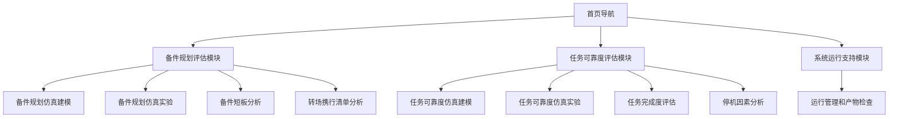

# 备件规划及任务可靠度验证评估平台全功能最小闭环 MVP PRD

| 项目 | 内容 |
| --- | --- |
| 文档版本 | V1.5 |
| 更新日期 | 2026-06-12 |
| 文档范围 | 覆盖全部 CSCI 部件的前后端最小闭环 MVP，包含 Phase 0 静态前端基线、后端能力、仿真运行、运行产物和验收证据 |
| 参考资料 | `3概要设计方案.docx` 中“CSCI体系结构设计 / 平台部件组成 / 系统功能原理”相关章节，及 `备件截图说明文档_润色版.docx` 中“备件规划评估模块 / 任务可靠度评估模块”相关章节 |
| 当前交付形态 | 已有 Phase 0 静态前端评审基线；当前 MVP 目标是继续补齐后端、仿真、产物和前端接入的最小闭环 |

## 1. 概述

### 1.1 背景

备件规划及任务可靠度验证评估平台用于支撑任务执行前后的备件保障评估、携行备件规划、任务完成概率评估和停机根因分析。概要设计中，平台 CSCI 部件包括“备件规划评估模块”“任务可靠度评估模块”和“系统运行支持模块”，其中结果分析能力是用户查看仿真与评估输出的核心入口。

当前 Phase 0 静态前端基线已经按 CSCI 完整部件范围补齐建模、实验、结果分析和运行支持入口，参考既有“保障方案分析”类页面形态，提供模块导航、启动分析、结果展示、表格和图形化呈现能力。Phase 0 页面中的结果数据均为前端内置演示数据，不代表真实仿真计算输出。

项目当前路线已经重置：之前版本的前端和建模实现均废弃。当前 PRD 以“全部功能的最小实现”为 MVP 范围：在所有 CSCI 部件上各形成一条可访问、可运行、可检查、可验收的最小路径。静态前端是页面和字段基线，不是最终 MVP。

### 1.2 产品目标

1. 为备件规划人员提供仿真建模、仿真实验、备件短板识别和转场携行清单分析页面。
2. 为任务评估人员提供任务可靠度建模、仿真实验、任务完成度趋势和停机因素拆解页面。
3. 为系统运行评审提供运行管理、样本统计和产物检查入口。
4. 保持页面结构统一，降低用户在不同模块和页面之间切换和理解的成本。
5. 通过表格、指标卡、柱状图和折线图展示核心分析结果，支撑快速研判。

### 1.3 目标用户

| 角色 | 使用目标 |
| --- | --- |
| 备件规划人员 | 查看备件满足率、延误时间、不满足次数，形成补充和携行建议 |
| 任务可靠度评估人员 | 查看任务波次成功概率、可靠度趋势和风险拐点 |
| 保障分析人员 | 查看停机因素层级、贡献次数和观察指标，定位保障瓶颈 |
| 项目评审人员 | 通过原型理解模块范围、页面结构和结果表达方式 |

### 1.4 产品范围

#### 1.4.1 当前 MVP 范围

当前 MVP 覆盖 3 个模块、9 个功能页面和一条最小运行闭环；若把首页导航也计入可访问页面，则共 10 个前端入口。每个入口都需要在后续阶段具备对应的后端能力或等价本地服务能力、可检查数据对象和验收路径。

| 一级模块 | 子页面 | 页面定位 |
| --- | --- | --- |
| 备件规划评估模块 | 备件规划仿真建模 | 展示任务、装备、保障组织、保障活动和指标分配的最小建模入口 |
| 备件规划评估模块 | 备件规划仿真实验 | 展示实验方案、可视化推演和蒙特卡洛实验配置入口 |
| 备件规划评估模块 | 备件短板分析 | 定位备件供应保障短板 |
| 备件规划评估模块 | 转场携行清单分析 | 基于优化条件和约束阈值展示携行建议 |
| 任务可靠度评估模块 | 任务可靠度仿真建模 | 展示任务剖面、装备故障、可靠性框图和指标分配的最小建模入口 |
| 任务可靠度评估模块 | 任务可靠度仿真实验 | 展示任务可靠度实验方案、可视化推演和蒙特卡洛实验配置入口 |
| 任务可靠度评估模块 | 任务完成度评估 | 评估多波次任务成功概率趋势 |
| 任务可靠度评估模块 | 停机因素分析 | 拆解停机因素和相关观察指标 |
| 系统运行支持模块 | 运行管理和产物检查 | 展示长周期大样本运行优化、运行目录、日志和结果产物检查入口 |

#### 1.4.2 CSCI 完整部件范围

以下范围来自 `3概要设计方案.docx` 的 CSCI 部件组成，用于说明平台完整能力边界。Phase 0 静态前端已为各类 CSCI 部件补齐最小页面入口；当前 MVP 还必须补齐字段契约、后端或本地服务能力、仿真运行、结果产物和验收检查。

| CSCI 部件 | 二级功能 | 三级功能 | 四级功能或能力点 | Phase 0 前端基线 |
| --- | --- | --- | --- | --- |
| 备件规划评估模块 | 仿真建模 | 任务建模 | 内置场景、基本作战单元建模、基本任务建模、任务剖面建模 | 已覆盖为静态建模页 |
| 备件规划评估模块 | 仿真建模 | 装备建模 | 装备组成建模、装备故障建模 | 已覆盖为静态建模页 |
| 备件规划评估模块 | 仿真建模 | 保障组织建模 | 保障组织结构建模、备件建模、保障人员建模、保障设备建模 | 已覆盖为静态建模页 |
| 备件规划评估模块 | 仿真建模 | 保障活动建模 | 保障资源需求组、装备修复性维修方案、装备预防性维修方案、装备使用保障方案 | 已覆盖为静态建模页 |
| 备件规划评估模块 | 仿真建模 | 指标分配方案管理 | 结果导入 | 已覆盖为静态建模页 |
| 备件规划评估模块 | 仿真实验 | 仿真实验方案管理 | 仿真实验方案创建、仿真实验方案编辑 | 已覆盖为静态实验页 |
| 备件规划评估模块 | 仿真实验 | 可视化推演 | 可视化实验启动与停止、场景切换、可视化结果展示 | 已覆盖为静态实验页 |
| 备件规划评估模块 | 仿真实验 | 蒙特卡洛实验 | 蒙特卡洛实验配置 | 已覆盖为静态实验页 |
| 备件规划评估模块 | 结果分析 | 结果分析 | 蒙特卡洛实验结果展示 | 已覆盖为静态实验页 |
| 备件规划评估模块 | 结果分析 | 结果分析 | 备件短板分析、飞机转场携行清单分析 | 已覆盖为静态页面 |
| 任务可靠度评估模块 | 仿真建模 | 任务建模 | 内置场景、基本作战单元建模、基本任务建模、任务剖面建模 | 已覆盖为静态建模页 |
| 任务可靠度评估模块 | 仿真建模 | 装备建模 | 装备组成建模、装备故障建模、装备可靠性框图建模 | 已覆盖为静态建模页 |
| 任务可靠度评估模块 | 仿真建模 | 保障组织建模 | 保障组织结构建模、备件建模、保障人员建模、保障设备建模 | 已覆盖为静态建模页 |
| 任务可靠度评估模块 | 仿真建模 | 保障活动建模 | 保障资源需求组、装备修复性维修方案、装备预防性维修方案、装备使用保障方案 | 已覆盖为静态建模页 |
| 任务可靠度评估模块 | 仿真建模 | 指标分配方案管理 | 系统可靠度、失效率、平均无故障工作时间等指标分配方案管理，整机 RMS 到 LRU 级 RMS 结果导入 | 已覆盖为静态建模页 |
| 任务可靠度评估模块 | 仿真实验 | 仿真实验方案管理 | 仿真实验方案创建、仿真实验方案编辑 | 已覆盖为静态实验页 |
| 任务可靠度评估模块 | 仿真实验 | 可视化推演 | 可视化实验启动与停止、场景切换、可视化结果展示 | 已覆盖为静态实验页 |
| 任务可靠度评估模块 | 仿真实验 | 蒙特卡洛实验 | 蒙特卡洛实验配置 | 已覆盖为静态实验页 |
| 任务可靠度评估模块 | 结果分析 | 结果分析 | 蒙特卡洛实验结果展示、飞机任务可靠性分析 | 已覆盖为静态实验页 |
| 任务可靠度评估模块 | 结果分析 | 结果分析 | 任务可靠度评估、停机因素分析 | 已覆盖为静态页面 |
| 系统运行支持模块 | 仿真运行支持 | 长周期大样本运行优化 | 面向蒙特卡洛实验的软件运行效率优化、样本调度和统计支撑 | 已覆盖为静态运行支持页 |

#### 1.4.3 范围边界说明

1. 当前已实现基线仍是静态前端评审页面，不代表后端、仿真内核、真实接口、运行调度或数据持久化已经完成。
2. 当前 MVP 不等同于远期完整版平台；它只要求每个 CSCI 部件形成最小可用路径，不要求完整复杂编辑器、长周期调度、权限体系或高精度算法深度。
3. 完整 CSCI 部件清单用于防止 PRD 遗漏概要设计范围；MVP 验收必须同时检查前端入口、后端能力、运行产物和字段契约。
4. 结果分析必须优先由后端运行产物或聚合结果驱动；前端静态常量只能作为空状态、演示状态或测试夹具。

## 2. 产品结构

### 2.1 页面架构

### 2.1.1 当前页面与 CSCI 部件映射

| 当前页面 | 所属 CSCI 部件 | 对应概要设计能力 | MVP 要求 |
| --- | --- | --- | --- |
| 备件规划仿真建模 | 备件规划评估模块 / 仿真建模 | 任务、装备、保障组织、保障活动和指标分配方案管理 | 前端入口 + 项目数据保存或导出 JSON |
| 备件规划仿真实验 | 备件规划评估模块 / 仿真实验 | 实验方案管理、可视化推演、蒙特卡洛实验和结果入口 | 前端入口 + 实验方案 + 固定种子运行 |
| 备件短板分析 | 备件规划评估模块 / 结果分析 | 利用蒙特卡洛实验产生的备件需求数据集，按备件需求量和不满足情况识别短板 | 前端结果 + 后端聚合结果 JSON |
| 转场携行清单分析 | 备件规划评估模块 / 结果分析 | 基于备件利用率、满足率和短缺风险迭代优化转场携行清单 | 前端结果 + 最小规则或启发式输出 |
| 任务可靠度仿真建模 | 任务可靠度评估模块 / 仿真建模 | 任务、装备故障、可靠性框图、保障组织和指标分配方案管理 | 前端入口 + 可靠度字段契约 |
| 任务可靠度仿真实验 | 任务可靠度评估模块 / 仿真实验 | 实验方案管理、可视化推演、蒙特卡洛实验和结果入口 | 前端入口 + 运行记录和样本结果 |
| 任务完成度评估 | 任务可靠度评估模块 / 结果分析 | 基于波次任务成功概率和任务可靠度指标展示任务完成趋势 | 前端趋势 + 后端聚合结果 JSON |
| 停机因素分析 | 任务可靠度评估模块 / 结果分析 | 对影响任务可靠度的停机因素进行识别、归因和贡献度展示 | 前端拆解 + 贡献度统计结果 |
| 运行管理和产物检查 | 系统运行支持模块 / 仿真运行支持 | 长周期大样本运行优化、样本统计、运行日志和结果产物检查 | 运行状态 + 日志 + 产物目录检查 |

### 2.2 全局布局

| 区域 | 说明 |
| --- | --- |
| 顶部栏 | 展示系统名称、版本、当前模块或项目信息、用户头像 |
| 首页导航 | 左侧展示 4 张参考截图，右侧按模块展示 9 个功能入口 |
| 子页面左栏 | 展示当前模块说明和同模块下的子页面切换按钮 |
| 子页面主区 | 上方为启动或参数配置区，下方为结果展示区 |

### 2.3 全局交互规则

1. 用户从首页点击子页面入口后，进入对应分析页。
2. 子页面左侧按钮用于同模块内切换。
3. 子页面右上角“返回导航”返回首页。
4. “启动”按钮用于模拟触发分析计算，点击后记录最近启动时间并显示提示。
5. 建模、实验、运行支持和“转场携行清单分析”展示静态参数配置区；其余结果分析页面仅保留“启动”按钮。
6. Phase 0 基线不接入后端、仿真内核、接口请求、计算进度或结果持久化；当前 MVP 后续阶段必须补齐这些闭环能力。

## 3. 功能需求

### 3.1 首页导航

#### 功能描述

首页用于承载三个一级模块和九个功能页面入口，并通过参考截图建立用户对结果页形态的预期。

#### 界面元素

| 元素 | 类型 | 说明 |
| --- | --- | --- |
| 系统标题 | 文本 | 展示“备件规划及任务可靠度验证评估平台 V1.0” |
| 参考截图区 | 图片列表 | 展示 4 个分析页面参考图 |
| 模块行 | 分组容器 | 展示一级模块名称 |
| 子页面入口 | 按钮 | 点击进入对应子页面 |

#### 验收标准

1. 首页展示 3 个模块和 9 个功能页面入口。
2. 点击任一入口后可进入对应页面。
3. 首页不展示“装备对象”元素。
4. 首页在桌面和移动视口下无水平溢出。

### 3.2 备件短板分析

#### 功能描述

参考文档描述，备件短板分析用于采集备件保障指标，计算满足率、平均延误时间、基层级库存和不满足次数，定位供应短板并可视化展示结果。

#### 用户故事

作为备件规划人员，我希望查看各备件的满足率、延误时间和不满足次数，以便快速识别优先补充对象。

#### 页面规则

1. 页面归属“备件规划评估模块”。
2. 参数配置区不展示任何输入项，仅保留“启动”按钮。
3. 结果展示区包含指标卡、明细表格和短板分析结论。

#### 数据展示

| 字段 | 说明 |
| --- | --- |
| 备件 | 备件编号或名称，如 P1、P2、P3 |
| 备件满足率 | 成功响应需求次数占总需求次数的比例 |
| 平均延误时间 | 需求未及时满足时的平均延迟交付时长 |
| 基层级数量 | 基层站点库存节点数 |
| 初始基层级库存 | 评估开始时的基层库存量 |
| 不满足次数 | 需求未被及时满足的频次 |
| 短板等级 | 关注、短缺、严重 |

#### 结果规则

1. 通过指标卡展示短板备件数量、最低满足率、最大平均延误和建议优先补充项。
2. 通过表格展示 P1、P2、P3 等备件的多维指标。
3. 通过横向色块突出“不满足次数”等短板指标。
4. 分析结论需指出重点风险备件和建议动作。

#### 验收标准

1. 页面顶部仅显示“启动”按钮，不出现参数配置输入项。
2. 表格至少展示备件、满足率、延误时间、不满足次数和短板等级。
3. 短板等级通过颜色或标签区分。
4. 点击“启动”后有启动反馈。

### 3.3 转场携行清单分析

#### 功能描述

参考文档描述，转场携行清单分析用于聚合携行备件数据，输出各备件配置数量、备件满足率、平均延误时间等指标，并展示保障能力差异。当前原型将参数配置调整为“优化条件 + 约束阈值”模式，用于评审演示携行清单配置思路。

#### 用户故事

作为备件规划人员，我希望设置清单优化条件和备件约束，以便生成满足保障要求的转场携行备件清单。

#### 参数配置

| 参数 | 类型 | 可选值/范围 | 必填 | 说明 |
| --- | --- | --- | --- | --- |
| 优化条件 | 下拉选择 | 使用可用度、出动架次率、再次出动准备时间 | 是 | 决定清单优化目标 |
| 任务可靠度 | 滚轮阈值 | 80%、85%、90%、100%，默认 90% | 是 | 作为演示原型的携行数量选择阈值 |
| 备件满足率 | 滚轮阈值 | 80%、85%、90%、100%，默认 90% | 是 | 作为演示原型的保障能力约束展示 |
| 备件利用率 | 滚轮阈值 | 80%、85%、90%、100%，默认 80% | 是 | 作为演示原型的资源利用约束展示 |

#### 输出字段

| 字段 | 说明 |
| --- | --- |
| 备件 | 备件编号或名称 |
| 备件满足率 | 转场任务中备件需求被及时响应的比例 |
| 平均延误时间 | 备件需求未及时满足时的平均延迟时长 |
| 数量 | 携行清单中该备件配置规模 |
| 携行优先级 | 高、中、低 |
| 图示 | 数量或保障能力差异的可视化条形展示 |

#### 业务规则

1. 用户可在“优化条件”中选择使用可用度、出动架次率或再次出动准备时间。
2. 当优化条件变化时，结果区的优化目标指标同步变化。
3. 约束条件固定展示“任务可靠度”“备件满足率”“备件利用率”三个滚轮阈值。
4. 满足率较低的备件应被标记为更高携行优先级。
5. 当前静态原型中，携行数量随“任务可靠度”阈值切换；“备件满足率”和“备件利用率”作为评审演示约束展示，不参与真实优化计算。
6. 输出结果需说明当前优化条件和约束条件。

#### 异常和边界

| 场景 | 处理规则 |
| --- | --- |
| 约束输入为空 | 当前原型使用默认阈值，不提供空值输入 |
| 约束值不在可选范围 | 当前原型仅允许选择 80%、85%、90%、100% |
| 无可用备件数据 | 展示空表格提示 |
| 计算服务异常 | 本轮不接入计算服务，该场景仅作为后续正式系统预留 |

#### 验收标准

1. 参数区展示 1 个优化条件下拉框和 3 个约束滚轮阈值。
2. 优化条件包含使用可用度、出动架次率、再次出动准备时间。
3. 页面展示任务可靠度、备件满足率、备件利用率三个约束项。
4. 修改优化条件后，结果指标卡同步更新。
5. 点击“启动”后有启动反馈。

### 3.4 任务完成度评估

#### 功能描述

参考文档描述，任务完成度评估用于定义任务波次，采集任务执行数据，计算成功概率，分析可靠度趋势并展示结果。

#### 用户故事

作为任务可靠度评估人员，我希望查看各波次任务成功概率和趋势，以便识别任务完成风险拐点。

#### 页面规则

1. 页面归属“任务可靠度评估模块”。
2. 参数配置区不展示任何输入项，仅保留“启动”按钮。
3. 结果展示区包含指标卡、折线图和波次明细表。

#### 数据展示

| 字段 | 说明 |
| --- | --- |
| 波次任务 | 第 N 波任务 |
| 波次任务成功概率 | 当前波次任务成功概率 |
| 累计出动架次 | 截止当前波次累计出动架次 |
| 可用飞机数 | 当前波次可用飞机数量 |
| 状态 | 满足、关注、风险 |

#### 结果规则

1. 通过指标卡展示首波成功概率、末波成功概率、风险拐点和累计出动架次。
2. 通过折线图展示波次成功概率趋势。
3. 当成功概率低于阈值时，应在状态列标记为风险或关注。

#### 验收标准

1. 页面顶部仅显示“启动”按钮，不出现参数配置输入项。
2. 折线图展示波次成功概率随任务推进的变化。
3. 表格展示每个波次的成功概率、累计出动架次、可用飞机数和状态。
4. 点击“启动”后有启动反馈。

### 3.5 停机因素分析

#### 功能描述

参考文档描述，停机因素分析用于拆解停机因素层级，统计发生频次，计算相关观察指标，并结构化输出分析结果。

#### 用户故事

作为保障分析人员，我希望看到停机一级因素、二级因素和观察指标，以便定位影响任务连续性的关键原因。

#### 页面规则

1. 页面归属“任务可靠度评估模块”。
2. 参数配置区不展示任何输入项，仅保留“启动”按钮。
3. 结果展示区包含指标卡、因素分栏和贡献度表格。

#### 因素定义

| 层级 | 示例 |
| --- | --- |
| 一级因素 | 无可用飞机、飞机故障 |
| 无可用飞机二级因素 | 全部飞机处于任务状态、飞机处于故障维修状态、飞机处于预防性维修状态、飞机处于使用保障状态 |
| 飞机故障二级因素 | P1、P2、P3、P4 组件故障等 |

#### 观察指标

| 类型 | 指标 |
| --- | --- |
| 预防性维修指标 | 飞机平均预防性维修间隔、飞机平均预防性维修时间 |
| 故障维修指标 | 飞机平均故障间隔时间、飞机平均故障维修时间 |
| 保障资源指标 | 保障设备满足率、备件满足率 |

#### 结果规则

1. 通过指标卡展示停机因素总次数、无可用飞机次数、飞机故障次数和备件满足率。
2. 通过三栏布局展示停机因素、二级因素和观察指标。
3. 通过表格展示二级因素贡献次数、贡献度和图示。
4. 贡献次数较高的因素应突出展示。

#### 验收标准

1. 页面顶部仅显示“启动”按钮，不出现参数配置输入项。
2. 页面展示一级因素、二级因素、观察指标三类结果。
3. 贡献度表格至少展示二级因素、贡献次数、贡献度和图示。
4. 点击“启动”后有启动反馈。

## 4. 数据与状态

### 4.1 页面状态

| 状态 | 说明 |
| --- | --- |
| 初始态 | 页面加载后展示默认模拟数据 |
| 已启动 | 点击“启动”后记录最近启动时间，结果区保持或刷新模拟结果 |
| 空数据 | 无结果时展示空表格提示 |
| 异常态 | 后续正式系统预留；当前静态原型不触发真实计算失败 |

### 4.2 埋点建议

| 事件名 | 触发时机 | 属性 |
| --- | --- | --- |
| `analysis_page_view` | 进入任一分析页 | module_id、page_id |
| `analysis_start_click` | 点击启动按钮 | module_id、page_id |
| `carry_objective_change` | 修改转场携行优化条件 | objective |
| `carry_constraint_change` | 修改约束输入 | field、value |
| `analysis_return_home` | 点击返回导航 | page_id |

## 5. 非功能需求

| 类型 | 要求 |
| --- | --- |
| 兼容性 | 支持 Chrome / Edge 主流桌面浏览器 |
| 响应式 | 页面在桌面和移动视口下不出现水平溢出 |
| 可读性 | 表格、指标卡、图表文字需清晰可读 |
| 易用性 | 子页面切换、返回导航和启动按钮位置保持一致 |
| 可维护性 | 页面数据、模块配置和渲染逻辑应尽量集中管理 |

## 6. 验收清单

| 编号 | 验收项 | 预期结果 |
| --- | --- | --- |
| AC-01 | 前端入口完整 | 展示 3 个模块、9 个功能页面入口，页面路由和返回导航可用 |
| AC-02 | 建模数据闭环 | 备件规划和任务可靠度建模入口都有最小字段契约，项目数据可保存或导出为可检查 JSON |
| AC-03 | 实验方案闭环 | 两类仿真实验入口都能创建或读取最小实验方案，并能引用固定种子运行配置 |
| AC-04 | 后端或本地服务能力 | MVP 提供项目、实验、运行、结果查询和产物读取能力，服务形态可为本地 HTTP API、CLI 适配层或等价本地服务 |
| AC-05 | 仿真运行闭环 | 示例项目可触发固定种子、小样本运行，并生成运行记录、日志、样本结果和聚合结果 |
| AC-06 | 备件短板分析 | 页面结果由聚合结果或结果 JSON 驱动，字段至少覆盖备件、满足率、延误、不满足次数和短板等级 |
| AC-07 | 转场携行清单分析 | 页面结果由最小优化规则或启发式规则输出，字段覆盖优化条件、约束摘要、携行数量和指标对比 |
| AC-08 | 任务完成度评估 | 页面结果由后端聚合结果输出，字段覆盖波次成功概率、累计出动架次、可用飞机数和风险状态 |
| AC-09 | 停机因素分析 | 页面结果由后端聚合结果输出，字段覆盖一级因素、二级因素、观察指标和贡献度统计 |
| AC-10 | 系统运行支持 | 页面可展示运行状态、运行目录、日志、错误记录和结果产物检查入口 |
| AC-11 | 产物可检查 | 每次样例运行至少生成输入规格、实验配置、运行日志、样本结果、聚合结果和前端结果 JSON |
| AC-12 | 演示边界清晰 | 静态常量和演示夹具只能作为 Phase 0 基线、空状态或降级路径，不得描述为真实仿真输出 |
| AC-13 | 响应式和可读性 | 1440px 桌面和 390px 移动视口无水平溢出，核心表格和按钮可读可用 |

## 7. 待确认项

1. [Phase 2] 当前 MVP 的最小项目数据是否以概要设计中的任务、装备、保障组织、备件、保障活动为第一版字段边界。
2. [Phase 2] 后端采用本地 HTTP API、CLI 适配层，还是两者同时提供。
3. [Phase 2] MVP 阶段是否需要轻量数据库，还是先使用文件型项目数据和运行产物目录。
4. [Phase 2 / Phase 3] 转场携行清单在 MVP 中采用启发式规则、简化优化算法，还是直接接入现有 `core/` 候选能力。
5. [Phase 2 / Phase 5] 四个结果分析页面是否都需要支持“实验方案选择”和“历史结果切换”。
6. [Phase 2 / Phase 3] MVP 验收样例数据是否以概要设计字段、`core/dataset/` 数据，还是人工整理的标准示例项目为准。
7. [Phase 5] 图表展示样式是否沿用当前静态前端基线，还是需要与最终平台组件库统一。
