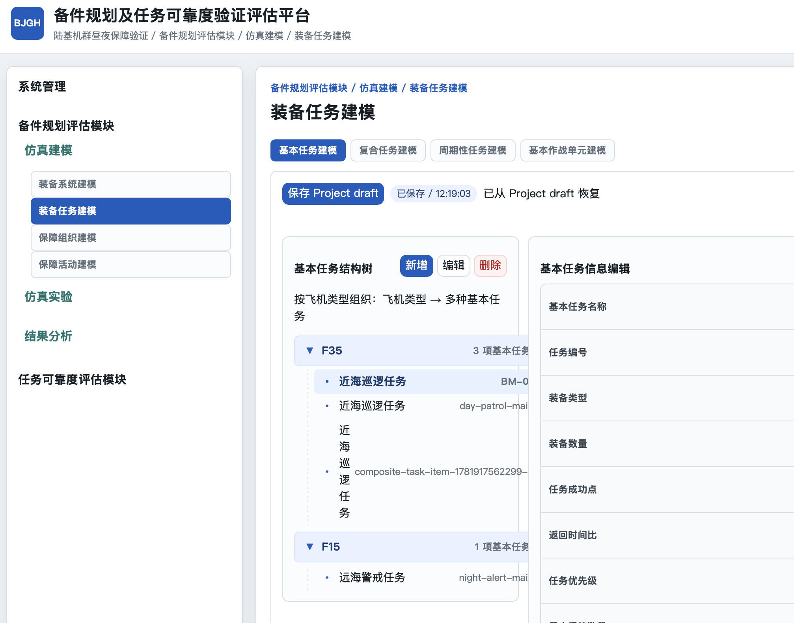

> 2026-06-20 决策：已取消“系统管理 / 项目管理 / 建模数据导入：删除此页面”。M5.2 建模数据导入工作台继续保留；本文件其余建议按页面修复范围执行。

1. 项目列表页

- 删除“进入当前项目"按钮，改为”添加“，每个项目条目中增加按钮”编辑“"删除"
- 右上角增加 系统管理 入口

2. 系统管理 / 项目管理 / 数据管理

   - 按 建模数据、实验配置、实验结果 三个tab，各自进入数据列表，数据可导出
3. 系统管理 / 项目管理 / 建模颗粒度管理

   - 只显示“层级、对象及关系”表，删除其他表
4. 系统管理 / 系统基础配置 / 用户管理

   - 添加用户：用户保存失败：User is not allowed to perform this action
   - 删除用户：无法选择用户，无法删除
5. 系统管理 / 系统基础配置 / 系统功能权限管理

   - 配置权限 按钮无效
6. 系统管理 / 系统基础配置 / 建模表单管理：删除此页面
7. 仿真建模 / 装备系统建模

   - 装备组成树
     - 删除 【编辑】 按钮
     - 【导入】按钮无功能
   - 组成属性
     - 删除“备件类型”
     - 是否为LRU 改为 组件属性，选项：LRU / SRU，可为空，选中后可取消选中改为空值
     - 增加属性“数量”
     - “数量”属性 > 1 时，N中取K 输入框才能编辑，约束：0 < N中取K值 <= “数量”
   - 装备故障建模
     - 可靠性 字段：
       - MTBF
       - 分布类型（下拉选择）：指数分布 / 威布尔分布
         - 选 威布尔分布时，跟随出现配置参数 形状参数(k)、尺度参数(λ) 类型：浮点数
     - 维修性 字段：
       - 平均修复时间（min）
       - 修复时间分布（下拉选择）
         - 正态分布：均值、方差
         - 均匀分布：最小值、最大值
         - 三角分布：最小值、最大值、模数
8. 仿真建模 / 装备任务建模 / 基本任务建模
   

   - 基本任务结构树，只显示树状图，不要出界，点击飞机、飞机叶子节点，只有第一条任务可以选中，其余不能选中，需修复
   - 基本任务结构树，删除“编辑”按钮
   - 基本任务信息编辑
     - 最小系统数量，改名为“最小装备数量”，位置放在“装备数量”之后
     - 删除字段：准备时间
   - 任务阶段表
     - 添加【添加】【编辑】【删除】按钮
     - 删除字段“状态”
     - 删除字段“转移条件”
     - 修改字段“阶段时限(h)”为 阶段占比，类型为0-1浮点数，约束为 各阶段占比总和为1
     - 添加字段“任务时间系数”，展开字典，显示对应飞机全部系统，填写系统工作时间系数，类型浮点数，约束 >= 0
9. 仿真建模 / 装备任务建模 / 复合任务建模

   - 复合任务列表
     - 删除‘序号’字段
     - 删除【编辑】按钮
     - 增加 选中 效果
   - 当前复合任务包含的基本任务
     - 取消‘序号’
     - 基本任务名称，应从 基本任务建模/基本任务结构树 中选择，不应文字输入
     - 装备类型，应不能编辑，从基本任务读入
     - 增加字段：任务时长，不可编辑，从基本任务读入
     - 删除字段：任务下达时间
     - 删除字段：回收时刻
     - 增加字段：要求装备数量
     - 删除按钮：编辑
   - 典型组合任务时序表
     - 删除字段“准备时间(min)”
     - 删除字段“任务下达时刻”
   - 典型组合任务时序图
     - 同一个基本任务的后续重复任务，画在同一条长方形中，不要增加条带
     - 允许绘制超出24小时的重复任务，长方形下方增加时刻标注，最长可达30小时
     - 超出30小时的重复任务，提示“任务时长过长，应新建复合任务，在周期性任务中组合“
   - 周期性任务列表
     - 删除 周期性任务列表
     - 任务周期天数，最大值30，下方 任务周期	复合任务名称 同步变化
10. 仿真建模 / 保障组织建模 / 保障组织结构建模

    - 保障组织结构树
      - 只能建两级节点
      - 删除【编辑】按钮
      - 删除【导入】按钮
    - 组织详情
      - 编辑框不可编辑，修复
11. 仿真建模 / 保障组织建模 / 备件建模

    - 保障组织结构树
      - 只显示，没有 【新增节点】、【编辑】、【删除】、【导入】
      - 选中根节点，汇总显示下级保障组织全部备件的名称、型号、数量
      - 只能选择叶子节点保障组织，才能编辑备件
    - 资源清单
      - 字段“型号/专业”改为“型号”
      - 编辑按钮无功能，修复
      - 增加复选框、【全选】按钮，使【批量删除】生效
12. 仿真建模 / 保障组织建模 / 保障人员建模

    - 保障组织结构树
      - 只显示，没有 【新增节点】、【编辑】、【删除】、【导入】
      - 选中根节点，汇总显示下级保障组织全部人员专业、数量
      - 只能选择叶子节点，才能编辑
    - 资源清单
      - 选中 保障组织结构树叶子节点，可【新增】
      - 删除字段“名称”
      - 字段“型号/专业”修改为“专业”
      - “适用机型”可多选
      - 增加复选框、【全选】按钮，使【批量删除】生效
13. 仿真建模 / 保障组织建模 / 保障设备建模

    - 保障组织结构树
      - 只显示，没有 【新增节点】、【编辑】、【删除】、【导入】
      - 选中根节点，汇总显示下级保障组织全部保障设备名称、型号、数量
      - 只能选择叶子节点，才能编辑
    - 资源清单
      - 选中 保障组织结构树叶子节点，可【新增】
      - 删除字段“名称”
      - 字段“型号/专业”修改为“型号”
      - “适用机型”可多选
      - 增加复选框、【全选】按钮，使【批量删除】生效
14. 仿真建模 / 保障活动建模 / 基本保障活动建模

    - 基本保障活动列表库，改名“基本保障活动基础库”
      - 【新增】按钮无反应，修复
      - 删除【导入】按钮
      - 【删除】按钮改为【批量删除】按钮
      - 增加“全选“按钮
      - 数据项可复选
      - 数据项【编辑】【删除】按钮无反应，修复
15. 仿真建模 / 保障活动建模 / 使用保障活动建模

    - 使用保障活动树
      - 默认显示全部机型，二级节点展开飞机基本任务，三级节点展开三类叶子节点“飞行前准备”、“再次出动准备”、“飞行后检查”
      - 删除按钮【新增分类】、【编辑】、【删除】、【导入】
      - 根节点“使用保障活动”改名为“全部机型”
    - 使用保障活动编辑
      - 删除编辑框“使用保障活动名称”
    - 工作项目清单
      - 【新增基本保障活动】 按钮无反应，修复
      - 数据项可复选、可全选，可使用【批量删除】按钮
      - 删除字段“子作业”
      - “紧前作业”可多选当前工作项目清单的其他工作项目
      - 删除字段“工期分布摘要”
      - 【编辑】、【删除】按钮功能修复
16. 仿真建模 / 保障活动建模 / 预防性维修活动建模

    - 预防性维修活动树
      - 【新增分类】按钮改名【新增】
      - 删除按钮【编辑】、【导入】
      - 只有选中装备节点，才能点击【新增】
      - 根节点“预防性维修活动”改名“全部机型“
      - 选中叶子节点，激活右侧 预防性维修活动编辑
    - 预防性维修活动编辑
      - 方案名称 目前不可编辑，修复
      - 计划停机小时 目前不可编辑，修复
      - 启动日历时间 目前不可编辑，修复为复选
      - 日历日间隔 改名“使用日历日间隔规则”，目前不可编辑，修复
      - 日历日间隔上下浮动比例(%) 目前不可编辑，修复为0-1小数
      - 启动飞行小时 改名“使用飞行小时规则” 目前不可编辑，修复
      - 飞行小时间隔 目前不可编辑，修复
      - 飞行小时上下浮动比例(%)，目前不可编辑，修复
      - 启动起落次数 目前不可编辑，修复
      - 起落次数间隔 目前不可编辑，修复
      - 起落次数间隔上下浮动比例(%) 目前不可编辑，修复
    - 工作项目清单
      - 【新增基本保障活动】 按钮无反应，修复
      - 数据项可复选、可全选，可使用【批量删除】按钮
      - 删除字段“子作业”
      - “紧前作业”可多选当前工作项目清单的其他工作项目
      - 删除字段“工期分布摘要”
      - 【编辑】、【删除】按钮功能修复
17. 仿真建模 / 保障活动建模 / 修复性维修活动建模

    - 装备构型树
      - 只有选中装备叶子节点，右侧才能激活 修复性维修活动编辑
    - 修复性维修活动编辑
      - 平均修复时间(min) 改为 最大修复时间(min)
      - 维修类型 单选 原位维修 / 换件维修
      - 删除字段：“维修时间分布类型”、“分布参数“、“特殊产品适用对象”、“特殊产品维修时间(min)”、“维修比例”、“换件比例”
    - 工作项目清单
      - 【新增基本保障活动】 按钮无反应，修复
      - 数据项可复选、可全选，可使用【批量删除】按钮
      - 删除字段“子作业”
      - “紧前作业”可多选当前工作项目清单的其他工作项目
      - 删除字段“工期分布摘要”
      - 【编辑】、【删除】按钮功能修复
18. 仿真建模 / 保障活动建模 / 后勤保障活动建模

    - 后勤保障运输策略配置
      - 运输起点 选择 保障组织节点
      - 运输终点 选择 保障组织节点
