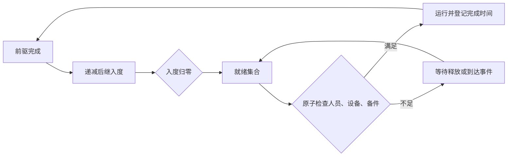

# 43 天案例：编译结构、事件触发资源分配与独立 SimPy 调度

这是在 `experiments/event_calendar` 第一轮实验之后开展的第二轮实验。
生产代码、接口、Project 契约和运行数据库未改动。

## 输入与计时口径

使用当前本机 `runs/system-start/spare_mvp.sqlite3` 中的
`project-j16-8aircraft-43day-availability-20260727-copy-2`。
**项目 ID 中的 J16/8 架是旧名称；本次实际编译结果为 9 架 F35、104 个任务波次、43 天（61,920 分钟）。**
设备树包含 424 个节点，其中 423 个进入故障行为组件；有 2 个保障节点、13 个保障活动。

沿用 `ContractRepository → ProjectJsonExporter → SimulationAdapter`，对产生的
`simulation_inputs` 执行现有 JSON Schema 校验，之后才生成实验 IR。
所有样本都禁用可视化帧，使用相同规范输入，按种子分别重建可变状态。
数据库以 `mode=ro` 打开，不把数据库或原始案例 JSON 放入实验目录。
数据 SHA-256、基线 commit、Python/SimPy 版本、实验代码 SHA-256 均记录在结果文件中。

每条路线先预热；正式使用种子 0、1、7，每种子重复 2 次，轮换执行顺序。
总耗时包含每样本初始化、仿真与返回对象构造，不包括 Adapter、共享 IR 编译、JSON 文件 I/O、API 和多进程 Monte Carlo 调度。
共享 IR 编译成本另报，不能把这里的加速比当成 API 端到端加速比。

## 六条路线

| 路线 | 运行机制 | 保障作业语义 |
| --- | --- | --- |
| `AircraftSupportV1Model` | 当前分钟内核 | 拓扑排序后串行 |
| `TriggeredModel` | 日历跳时；状态改变才重试资源分配 | 保留串行 |
| `CompiledModel` | 共享结构模板、活动作业集合、活动 ID 索引 | 保留串行 |
| `SimpyProcessModel` | 独立 SimPy generator 驱动；原生 Event 唤醒资源分配进程 | 保留串行 |
| `ParallelDAGModel` | 编译后的前驱计数／后继表释放就绪节点；日历推进 | 飞前作业按 DAG 并行 |
| `SimpyDAGModel` | 同一编译 DAG；SimPy generator 和事件资源分配进程 | 飞前作业按 DAG 并行 |

SimPy 两条路线**不调用** `AircraftSupportV1Model.step()`；验证程序会把该方法替换成抛异常函数来检查串行 SimPy 路线。
它们复用现有任务、故障、维修、运输和原子资源分配方法，以及最终结果构造。
所以“独立”指独立调度执行器，并不意味着六份互相独立的业务逻辑实现。
这里没有采用 SimPy `Resource` 替换现有多类资源原子分配器；多个资源逐个 `request` 会另行引入占有／等待规则变化，不能作为等价性能对照。

`CompiledStructure` 只接收规范仿真输入，生成可跨样本复用的飞机、组件、任务、保障节点和活动模板，以及作业代码到整数节点的映射、前驱／后继数组、关键路径与串行时长。
每个样本复制可变状态，单独初始化 RNG 和故障计时；不共享库存、占用量或随机状态。
这仍是 Python 对象模板 IR，不是完整数组内核、机器码或全部随机分支的展开图。

## 怎样消除每分钟资源争抢

资源分配使用一个变更序号。新增作业、资源释放、运输到达、取消后备件归还以及同步补给会改变序号，只有序号变化后才重新检查等待集合。
实际分配沿用原来的确定性优先级和多类资源原子预留；没有反复抢占已运行作业。
同一分钟后段发生释放时，允许下一分钟做一次收敛处理，以保留原阶段顺序；这不是持续轮询。
处理完的历史作业保留供结果查询，但从运行时扫描集合中移出。

并行 DAG 中，每个节点只等待真实前驱完成。完成一个节点就递减直接后继的入度，入度归零才加入就绪集合；资源不足则等待下一次资源变更。



图的静态部分不包含所有可能的故障、补给和资源竞争分支。库存和人员是否够用仍由运行时状态决定；本实验消除的是没有状态变化时的重复尝试。

## 两类验收，不混用加速比

保留串行语义的三条候选路线与分钟基线逐字段比较完整结果，并额外比较飞机、任务、作业、资源、在途运输、逻辑步数和 RNG 最终状态。
仅允许放宽 `downtime_resource_delay_events`，以及 `personnel_delay`、`equipment_shortage` 这两种轮询型辅助事件。
其余指标、事件及时间戳必须一致；输出报告同时保留“完整一致”和“核心一致”结果。

并行 DAG 会改变作业开始／完成时间和资源占用轨迹，属于行为实验。
两版 DAG 执行器互相严格差分，并检查资源容量、容量预留守恒、备件守恒和前驱先于后继完成；不要求它们等于原串行基线。
真实案例预热运行也启用这些不变量检查，正式计时关闭检查开销。

飞前保障包含 14 个节点、16 条依赖边：串行时长 **142 分钟**，无资源限制的关键路径 **42 分钟**。
42 分钟只是下界；多个飞机共享资源时必须执行实际排程。
现有内核使用的确定性 `durationMinutes` 继续生效，本实验没有另行启用 `durationProfile` 分布采样。
静态图见 [preflight-dag.md](preflight-dag.md)。当前实验要求前驱引用无重复；不把已测案例通过推广为对任意合法 Project 的生产兼容承诺。

## 复现

需要项目既有 Python 3.12 环境，以及第一轮实验固定的 `simpy==4.1.1`。

```bash
.abm-mesa-test-env/bin/python experiments/compiled_routes/verify.py \
  experiments/compiled_routes/verification.json

.abm-mesa-test-env/bin/python experiments/compiled_routes/benchmark.py \
  --database runs/system-start/spare_mvp.sqlite3 \
  --project-id project-j16-8aircraft-43day-availability-20260727-copy-2 \
  --seeds 0,1,7 --repeats 2 \
  --output experiments/compiled_routes/results-43day.json
```

数据库是本机运行状态，其他机器复现时需要同一案例的只读数据库副本；先核对报告中的规范输入 hash。
公开小案例验证不依赖该数据库：117 组串行差分、2 组手算 DAG 排程、2,447 次不变量检查、3 种非法图拒绝，以及 6 组取消后备件归还唤醒检查已通过。
手算 DAG 是 2 分钟前置 → 3/5 分钟并行分支 → 2 分钟汇合：双份资源在第 10 分钟完成飞前保障，单份资源在第 13 分钟完成（第 1 分钟开工）。

额外唤醒检查让一个无法获得人员的飞前作业预留最后一件备件，另一个维修作业等待该备件；前者在第 6 分钟取消，后者必须在第 7 分钟开工。初版缺少这个通知而使维修永久等待，已修复并在所有路线复核；正式计时使用修复后的代码。

正式计时与行为变化见 [results-43day.json](results-43day.json)，验证结果见 [verification.json](verification.json)。

## 结论的适用边界

- “预编译结构”路线同时包含活动作业集合与活动 ID 索引，不能将相对状态触发路线的收益全部归因于拓扑排序或 IR 缓存。
- 并行 DAG 缩短的是可能的保障作业历时；仿真器为更多就绪节点建立状态对象，其计算耗时未必更低。样本 0 的作业记录从串行的 356 条增加到 DAG 的 2,463 条，这也是活动集合索引必须保留的原因。
- 三个种子只用于工程差分和行为诊断，不足以证明 DAG 并行能提高总体任务成功率或可用度。业务语义变化后，后续维修采样的先后次序也可能变化；要做可信的方案效果评价，应再建立按实体／事件命名的随机流或固定外生故障序列。
- 目前仍扫描活动状态来选择下一时点，故障计时也保留原浮点减法顺序；尚未实现完整的事件增量队列、数组状态、机器码执行或静态资源最优排程。
- 因此当前推荐先保留串行语义，采用状态触发与活动集合索引；将 DAG 并行作为明确的建模语义选项继续验证。SimPy 可以承担独立调度器，现有实测没有显示出替换为 SimPy 本身就能额外带来数量级性能收益。

## 正式结果（2026-09-18）

每条路线 3 个种子 × 2 次重复，以下为 6 次总耗时的中位数。

| 路线 | 中位耗时（秒） | 相对分钟基线 | 语义 |
| --- | ---: | ---: | --- |
| 分钟基线 | 22.474 | 1.00× | 原串行语义 |
| 状态触发 | 4.255 | 5.28× | 保留串行 |
| 编译结构 + 活动作业索引 | 3.368 | 6.67× | 保留串行 |
| 独立 SimPy 调度 | 3.607 | 6.23× | 保留串行 |
| 并行 DAG + 直接调度 | 3.709 | 6.06× | 改变飞前作业语义 |
| 并行 DAG + SimPy | 3.666 | 6.13× | 改变飞前作业语义 |

共享 IR 编译耗时 0.0457 秒（另列，未隐藏在速度比中）；Adapter 导出／编译耗时 0.7417 秒。

三个保留串行语义的候选路线共 18 组比较全部**完整一致**，本案例没有实际用到辅助指标放宽。两版 DAG 共 6 组比较也完整一致，包括最终业务状态和 RNG 状态。
真实 43 天案例预热阶段累计通过 30,865 次不变量检查；这些带检查的运行不计入性能表。
现有模型回归 `python -m unittest tests.test_aircraft_support_v1_model` 的 112 项测试通过；新增文件空白检查与 `git diff --check` 通过。

样本 0：完整阶段执行次数由 61,920 降为 4,016；资源分配扫描次数由 61,920 降为 1,437。并行 DAG 进一步降到 3,697 个阶段时点、1,292 次资源分配扫描，但总耗时仍高于串行编译路线。

### 并行 DAG 的业务变化

下表比较同一输入和种子的原串行基线与并行 DAG。它展示观察到的变化，不是总体改善结论。

| 种子 | 任务成功波次：串行 → DAG | 完成架次：串行 → DAG | 可用度：串行 → DAG |
| --- | --- | --- | --- |
| 0 | 66 → 66 | 135 → 135 | 0.610034 → 0.609927 |
| 1 | 64 → 65 | 130 → 133 | 0.652993 → 0.652993 |
| 7 | 77 → 77 | 164 → 164 | 0.744294 → 0.744294 |
