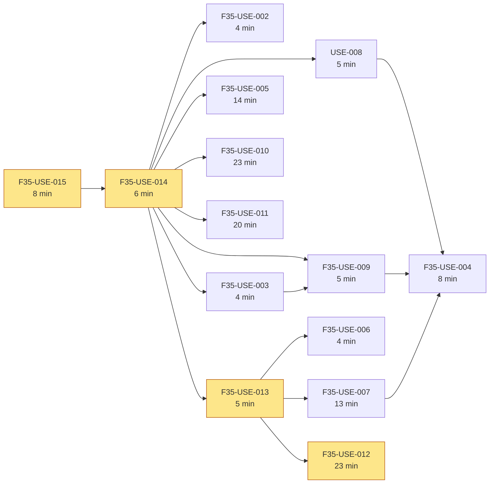

# 43 天案例：飞前保障预编译 DAG

14 个节点、16 条前驱边；串行合计 142 分钟，无资源约束的关键路径 42 分钟。
这里只画静态依赖，人员／设备／备件由执行器在节点就绪时原子检查。

```mermaid
flowchart LR
  n0["F35-USE-015<br/>8 min"]
  n1["F35-USE-014<br/>6 min"]
  n2["F35-USE-002<br/>4 min"]
  n3["F35-USE-003<br/>4 min"]
  n4["F35-USE-005<br/>14 min"]
  n5["USE-008<br/>5 min"]
  n6["F35-USE-009<br/>5 min"]
  n7["F35-USE-010<br/>23 min"]
  n8["F35-USE-011<br/>20 min"]
  n9["F35-USE-013<br/>5 min"]
  n10["F35-USE-006<br/>4 min"]
  n11["F35-USE-007<br/>13 min"]
  n12["F35-USE-012<br/>23 min"]
  n13["F35-USE-004<br/>8 min"]
  n0 --> n1
  n1 --> n2
  n1 --> n3
  n1 --> n4
  n1 --> n5
  n1 --> n6
  n3 --> n6
  n1 --> n7
  n1 --> n8
  n1 --> n9
  n9 --> n10
  n9 --> n11
  n9 --> n12
  n5 --> n13
  n6 --> n13
  n11 --> n13
  classDef critical fill:#fde68a,stroke:#b45309
  class n0,n1,n9,n12 critical
```

黄色节点为一条关键路径：8 + 6 + 5 + 23 = 42 分钟。
资源冲突会增加等待；这个下界不代替实际多机排程。
